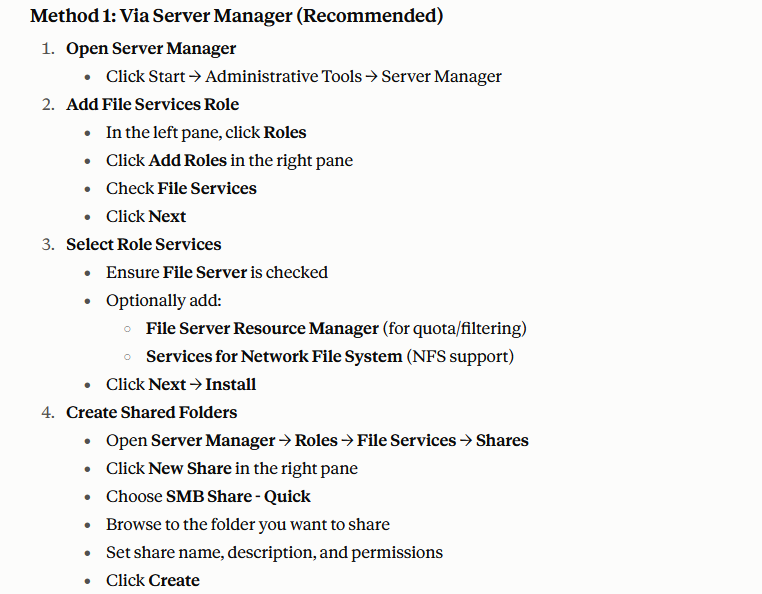

# Test packer if it builds as intented
Speed of packer ->

# Add more services like this 

- enable samba 
- enable mtfs  ???

- domain controller 
- desktop workstation
- active directory 
- kerberos thing
- group policy  ( automatic login reboot )
- windows eternal blue

- docker open API <<check if it can be isntalled>>

# Configure services

- ssh add global config need more quiestions
- jenkins
- wordpress

# check if hackable
- GlassFish
- ApacheStruts
- Tomcat
- ApacheAxis2
- Wordpress
- PHPmyAdmin
- elastic search

# TODO !!!
packer load initial stuff the build and then it works on its own 

# Notes
Automation is not a must
Can be done by hand in the VM

# Plan 

first create initial boot via packer. Potem pa manually dodajat featurje
Side Thing customize the king_reader file to se who is the king